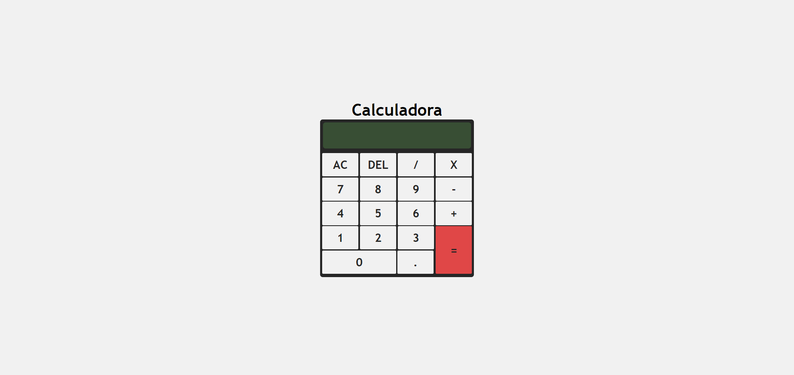

# Calculadora Simples

Uma calculadora simples implementada com HTML, CSS e JavaScript. Este projeto permite realizar operações matemáticas básicas diretamente no navegador.

## Demonstração

## Funcionalidades

- Operações suportadas: Adição, Subtração, Multiplicação, Divisão.
- Botão `AC` para limpar todos os valores inseridos.
- Botão `DEL` para remover o último caractere.
- Suporte a números decimais.